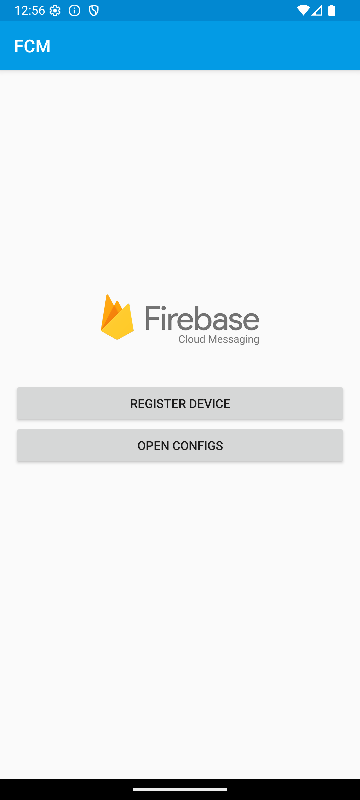
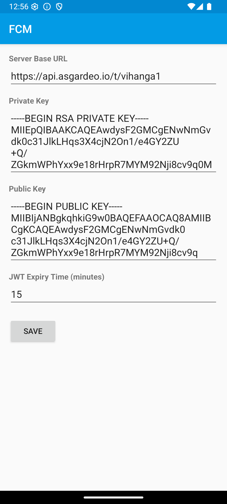
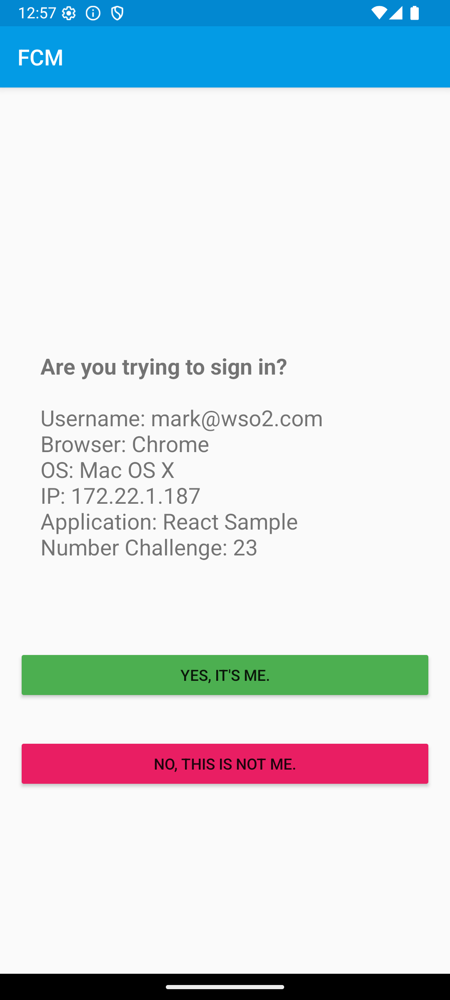
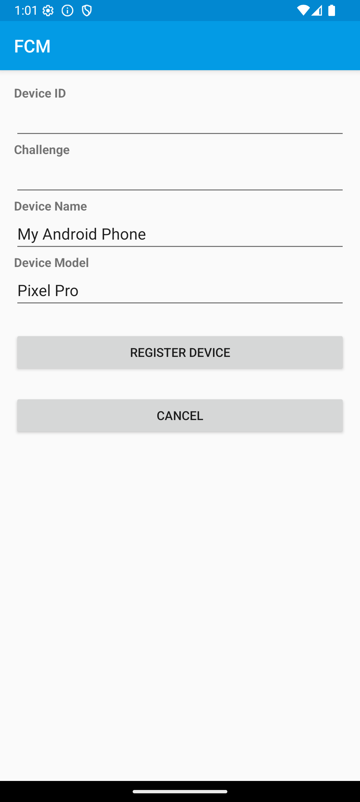

# FCM Based Push Authentication Sample
This is a sample android application created to demo push notification based authentication with WSO2 IS and Asgardeo.
https://is.docs.wso2.com/en/latest/guides/authentication/passwordless-login/add-passwordless-login-with-push-notification

## Screenshots

<table width="100%">
  <tr>
    <td width="33%">
      
    </td>
    <td width="33%">
      
    </td>
  </tr>
  <tr>
    <td width="33%">
      
    </td>
    <td width="33%">
      
    </td>
  </tr>
</table>
